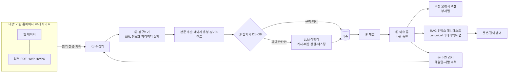

# 콘텐츠 건강검진(가칭) — 구성명세서

> 바이브 코딩 도구(Claude Code 등)에 그대로 넣어 구현할 수 있는 수준의 구현 명세

| 항목 | 내용 |
|---|---|
| 문서 버전 | v0.1 (초안) |
| 작성일 | 2026-09-21 |
| 짝 문서 | `콘텐츠위생앱_기획서.md` — 왜 만드는지, 누구를 위한 것인지, 범위·일정·사업화 |
| 코드명 | `hygiene` |
| 검증 표시 | ✅ = 이 문서 작성 중 실제 실행해 동작을 확인한 코드 / 그 외 코드는 설계 스케치 |

---

## 0. 이 문서 사용법

1. 전체를 한 번에 시키지 않는다. **13장 빌드 순서**대로 한 단계씩 진행한다.
2. 각 단계에서 코딩 도구에 넣을 것: ① 이 문서의 3장(폴더 구조)·5장(DDL) ② 해당 단계가 가리키는 절 ③ 그 단계의 완료 기준.
3. 완료 기준의 테스트가 통과한 뒤에만 다음 단계로 간다.
4. 임계값은 전부 **초기값**이다. `config.yaml`에 두고, 11장의 골드셋으로 조정한다. 코드에 숫자를 박지 않는다.
5. 실제 사이트를 두드리는 테스트는 만들지 않는다. 저장해 둔 스냅샷(fixtures)으로만 테스트한다.

---

## 1. 시스템 구성



구성 요소는 넷이다.

| 구성 요소 | 역할 | 단계 |
|---|---|---|
| `hygiene` 코어(Python 패키지) | 수집·정규화·탐지·채점·내보내기. CLI로 전부 실행 가능 | MVP |
| PostgreSQL + pgvector | 모든 상태 저장 | MVP |
| API 서버(FastAPI) | 코어를 HTTP로 노출, 인증·권한, 승인 이력 | 파일럿 |
| 웹 화면(Next.js) | 대시보드·이슈 큐·클러스터·규칙·내보내기 | 파일럿 |

---

## 2. 기술 스택

| 영역 | 선택 | 메모 |
|---|---|---|
| 언어 | Python 3.11 이상 | 버전은 설치 시점 최신 안정판으로 잠금 파일에 고정 |
| HTTP | httpx(비동기) | 조건부 요청, 타임아웃, 재시도 |
| JS 렌더링 | Playwright | 필요한 사이트만(설정 또는 휴리스틱) |
| HTML 파싱 | selectolax 또는 lxml | |
| 본문 추출 | trafilatura + 사이트별 CSS 선택자 폴백 | |
| 한국어 토큰화 | kiwipiepy | localrag와 동일 계열 — 유틸 공유 |
| 근사 중복 | datasketch(MinHash·LSH) | |
| 첨부 추출 | PyMuPDF·pdfplumber(PDF), zip+XML(HWPX), pyhwp 또는 LibreOffice 변환(HWP) | HWPX 에이전트의 파서가 있으면 그것을 우선 재사용. 환경에서 검증 후 확정 |
| 숫자·단위 파싱 | fact_checker의 한국어 숫자 파서 | "3천원" = "3,000원" |
| DB | PostgreSQL + pgvector, SQLAlchemy 2, Alembic | 도커 이미지 `pgvector/pgvector` |
| CLI | Typer | |
| 엑셀 | openpyxl | |
| 설정·검증 | pydantic v2, PyYAML | |
| 재시도·로그 | tenacity, structlog | |
| 테스트 | pytest | 네트워크 없는 테스트만 |
| API | FastAPI + Uvicorn | 파일럿 |
| 화면 | Next.js(App Router)·TypeScript·Tailwind·TanStack Table·Recharts | fact_checker와 동일 구성, 로그인·조직 분리 코드 공유 |
| 배포 | docker compose(개발·진단) → 기관 납품 시 CSAP 리전 | 화면은 개발 중 Vercel 가능 |

**모델 정책**
- LLM·임베딩 모두 어댑터 뒤에 둔다(7장). OpenAI 호환 엔드포인트 클라이언트 하나로 시작하면 국산 API 대부분과 자체 서빙(TenOS-Ko-28B 등)을 같은 코드로 붙일 수 있다 `(각 사 호환 여부 확인 필요)`.
- 중국계 모델은 제외한다. **임베딩도 해당된다** — BGE 계열과 그 파생 모델, Qwen 기반 임베딩은 쓰지 않는다. 후보: 국산 API 임베딩, OpenAI `text-embedding-3-small`(강의안 단가 기준), 로컬 CPU는 multilingual-e5 계열(라이선스 확인).
- 모델명·단가는 코드가 아니라 `config.yaml`에 둔다. 단가는 발주 전 재확인한다.

---

## 3. 저장소 구조

```
hygiene/
├─ pyproject.toml
├─ docker-compose.yml            # postgres(pgvector) + api + worker
├─ config.example.yaml
├─ .env.example                  # DB_URL, LLM_API_KEY, EMBED_API_KEY ...
├─ alembic/                      # 마이그레이션
├─ src/hygiene/
│  ├─ cli.py                     # Typer 진입점
│  ├─ config.py                  # pydantic 설정 모델
│  ├─ db/ models.py  session.py
│  ├─ crawl/
│  │  ├─ fetcher.py              # httpx, 조건부 요청, 속도 제한, 회로 차단
│  │  ├─ robots.py
│  │  ├─ render.py               # Playwright 폴백
│  │  ├─ frontier.py             # URL 큐, 깊이·상한
│  │  └─ attachments.py
│  ├─ normalize/
│  │  ├─ urlnorm.py              # 6.2 ✅
│  │  └─ param_test.py           # 파라미터 유의성 실험
│  ├─ extract/
│  │  ├─ maintext.py  metadata.py  pagetype.py  dates.py
│  │  ├─ fingerprint.py          # 6.3 ✅
│  │  └─ files/ pdf.py hwpx.py hwp.py
│  ├─ detect/
│  │  ├─ base.py                 # Detector 프로토콜, Issue 생성·지문
│  │  ├─ d1_duplicate.py  d2_title.py  d3_stale.py  d4_board_dual.py
│  │  ├─ d5_url_link.py   d6_attachment.py  d7_fact_conflict.py  d8_pii.py
│  ├─ llm/
│  │  ├─ base.py  openai_compat.py  cache.py  budget.py  masking.py
│  │  └─ prompts/ p1_title.md p2_stale.md p3_facts.md p4_structure.md p5_plain.md
│  ├─ score/ readiness.py  site_score.py  kpi.py
│  ├─ export/ manifest.py  maps.py  tickets_xlsx.py  sitemap.py  report_md.py
│  ├─ monitor/ incremental.py  lifecycle.py
│  └─ api/ main.py  routes/  auth.py          # 파일럿
├─ web/                          # Next.js (파일럿)
├─ rules/
│  ├─ timebound_keywords.yaml    # 시한 키워드 사전
│  ├─ boards.yaml                # 게시판 규칙(목록/상세 패턴, 시민 작성 게시판, 구·신 게시판 쌍)
│  ├─ subject_aliases.yaml       # D7 대상 이름 동의어
│  └─ issue_messages_ko.yaml     # 이슈 코드별 쉬운 말 설명
├─ tests/
│  ├─ fixtures/                  # 저장한 HTML 스냅샷 + 기대 결과
│  ├─ unit/  regression/
└─ data/                         # 스냅샷·첨부(깃 제외)
```

---

## 4. 설정

### 4.1 `config.yaml` (예시)

```yaml
org:
  name: "마포구청"
  today: null                 # null이면 실행일. 테스트에서만 고정

sites:                        # 공공데이터포털 15127404 목록으로 채운다 (확인 필요)
  - key: main
    name: "마포구청 대표"
    base_url: "https://www.mapo.go.kr"
    origin_group: "mapo-main"         # 같은 원 서버를 쓰는 사이트는 같은 그룹 → 속도 제한 공유
    priority: 1                       # 대표 URL 선정 시 낮을수록 우선
    owner_path_prefixes: ["/site/main/"]
    default_title: "마포구청 | 대표사이트"
    crawl_mode: full                  # full | linkcheck_only | excluded
    render: false
    content_selector: null            # trafilatura 실패 시 쓸 CSS 선택자
  - key: silver
    base_url: "https://silver.mapo.go.kr"
    origin_group: "mapo-main"
    priority: 50
    owner_path_prefixes: ["/site/silver/"]
  - key: eminwon
    base_url: "https://eminwon.mapo.go.kr"
    origin_group: "saeol"
    crawl_mode: linkcheck_only        # 신청·처리 화면은 수집하지 않는다

crawl:
  user_agent: "TenAI-ContentHygiene/0.1 (+연락처 URL; 담당 이메일)"
  respect_robots: true
  rate_per_origin_rps: 1.0
  concurrency_per_origin: 1
  window_kst: ["22:00", "06:00"]      # 전수 수집 허용 시간대
  timeout_s: 20
  max_pages_per_site: 100000
  max_depth: 12
  max_attachment_mb: 20
  circuit_breaker: {error_rate: 0.05, window: 200, cooldown_min: 30}
  param_test: {sample_per_group: 5, agree_ratio: 0.8, max_requests: 3000}

extract:
  min_body_chars: 200
  shingle_k: 5
  shingle_k_short: 3                  # 토큰 60개 미만 문서
  num_perm: 128

detect:
  d1: {lsh_threshold: 0.70, confirm_jaccard: 0.85}
  d2: {mass_shared_min: 10, h1_jaccard_max: 0.2, semantic_cos_max: 0.25}
  d3: {age_days_weak: 365, dead_link_ratio_weak: 0.3, board_index_months: 24, kpi_stale_days: 90}
  d5: {variants_min: 5, redirect_hops_min: 2, recheck_hours: 6}
  d6: {body_chars_max: 300}
  d7: {subject_cos_min: 0.85, max_facts_per_doc: 20}
  d8: {alert_immediately: ["D8_RRN", "D8_FRN"]}

llm:
  provider: openai_compat
  base_url: "${LLM_BASE_URL}"
  model_judge: "${LLM_MODEL_JUDGE}"   # 경량 모델: 판정·분류·추출
  model_draft: "${LLM_MODEL_DRAFT}"   # 주력 모델: 구조화 초안·요약(파일럿)
  temperature: 0
  max_concurrency: 4
  budget_krw_per_run: 200000          # 넘으면 중단하고 보고
  price_per_1m_tokens_usd: {input: 0.25, output: 1.50}   # 확인 필요
  usd_krw: 1345

embedding:
  provider: openai_compat
  model: "${EMBED_MODEL}"
  dim: 1024                           # 모델에 맞춘다. DDL의 vector 차원과 일치해야 함

score:
  weights: {dup: 30, title: 20, stale: 20, conflict: 15, broken: 10, url: 5}
  caps:    {dup: 0.30, title: 0.30, stale: 0.30, conflict: 0.05, broken: 0.10, url: 0.50}
```

### 4.2 비밀값
- `.env`에만 둔다: `DB_URL`, `LLM_API_KEY`, `EMBED_API_KEY`, `LLM_BASE_URL` 등. 저장소에 올리지 않는다.

---

## 5. 데이터 모델 (PostgreSQL)

핵심 9개(site, run, url_raw, document, snapshot, cluster, fact, issue, action) + 보조 6개(attachment, link, org_unit, param_rule, llm_cache, job).
아래 DDL은 PostgreSQL 파서로 문법을 검증했다 ✅ (실제 DB 적용과 pgvector 확장 확인은 S0에서).

```sql
CREATE EXTENSION IF NOT EXISTS vector;

CREATE TABLE site (
  site_id        SERIAL PRIMARY KEY,
  site_key       TEXT UNIQUE NOT NULL,
  name           TEXT NOT NULL,
  base_url       TEXT NOT NULL,
  origin_group   TEXT NOT NULL,
  crawl_mode     TEXT NOT NULL DEFAULT 'full',
  priority       INT  NOT NULL DEFAULT 100,
  owner_path_prefixes TEXT[] NOT NULL DEFAULT '{}',
  default_title  TEXT,
  lang           TEXT NOT NULL DEFAULT 'ko'
);

CREATE TABLE run (
  run_id       BIGSERIAL PRIMARY KEY,
  kind         TEXT NOT NULL,                  -- full | incremental | fixtures
  started_at   TIMESTAMPTZ NOT NULL DEFAULT now(),
  finished_at  TIMESTAMPTZ,
  config_hash  TEXT NOT NULL,
  stats        JSONB NOT NULL DEFAULT '{}'     -- 수집 수, 오류율, LLM 비용 등
);

CREATE TABLE document (
  doc_id        BIGSERIAL PRIMARY KEY,
  site_id       INT REFERENCES site,
  canonical_url TEXT NOT NULL,                 -- 앱이 선정한 대표 URL
  page_type     TEXT NOT NULL,                 -- content | board_post | board_list | citizen_post | file | nav | error
  title         TEXT,
  h1            TEXT,
  breadcrumb    TEXT[],
  declared_canonical TEXT,                     -- <link rel="canonical"> 값
  lang          TEXT,
  department    TEXT,
  contact_phone TEXT,
  posted_at     DATE,
  latest_date_in_text DATE,
  body_text     TEXT,                          -- 개인정보 마스킹 후 저장
  body_len      INT,
  content_sha256 TEXT,
  minhash       BYTEA,
  embedding     vector(1024),                  -- config.embedding.dim 과 일치
  cluster_id    BIGINT,
  readiness     TEXT,                          -- ready | fix_first | exclude
  readiness_reasons TEXT[] NOT NULL DEFAULT '{}',
  first_seen_run BIGINT REFERENCES run,
  updated_run   BIGINT REFERENCES run
);
CREATE INDEX ON document (content_sha256);
CREATE INDEX ON document (site_id, page_type);

CREATE TABLE url_raw (
  url_id        BIGSERIAL PRIMARY KEY,
  site_id       INT REFERENCES site,
  url           TEXT UNIQUE NOT NULL,          -- 발견된 그대로
  url_norm      TEXT NOT NULL,                 -- 6.2 정규화 결과
  flags         TEXT[] NOT NULL DEFAULT '{}',  -- escape_bug | state_params | jsessionid | http_link
  last_status   INT,
  final_url     TEXT,
  redirect_hops INT NOT NULL DEFAULT 0,
  content_type  TEXT,
  etag          TEXT,
  last_modified TIMESTAMPTZ,
  fetched_at    TIMESTAMPTZ,
  in_sitemap    BOOLEAN NOT NULL DEFAULT false,
  doc_id        BIGINT REFERENCES document,
  first_seen_run BIGINT REFERENCES run
);
CREATE INDEX ON url_raw (url_norm);
CREATE INDEX ON url_raw (doc_id);

CREATE TABLE snapshot (
  snapshot_id  BIGSERIAL PRIMARY KEY,
  doc_id       BIGINT REFERENCES document,
  run_id       BIGINT REFERENCES run,
  content_sha256 TEXT NOT NULL,
  html_path    TEXT,                           -- data/snapshots/... (gzip). 개인정보 탐지 문서는 마스킹본만
  taken_at     TIMESTAMPTZ NOT NULL DEFAULT now()
);

CREATE TABLE attachment (
  attachment_id BIGSERIAL PRIMARY KEY,
  doc_id       BIGINT REFERENCES document,
  url          TEXT NOT NULL,
  filename     TEXT,
  ext          TEXT,                           -- pdf | hwp | hwpx | xlsx ...
  size_bytes   BIGINT,
  text_extracted TEXT,
  extract_status TEXT                          -- ok | too_large | scanned | unsupported | error
);

CREATE TABLE link (
  from_doc_id  BIGINT REFERENCES document,
  to_url_norm  TEXT NOT NULL,
  to_doc_id    BIGINT REFERENCES document,
  is_external  BOOLEAN NOT NULL DEFAULT false,
  last_status  INT,
  checked_at   TIMESTAMPTZ,
  PRIMARY KEY (from_doc_id, to_url_norm)
);

CREATE TABLE cluster (
  cluster_id   BIGSERIAL PRIMARY KEY,
  kind         TEXT NOT NULL,                  -- exact | near
  canonical_doc_id BIGINT REFERENCES document,
  canonical_rule TEXT,                         -- 어떤 규칙으로 대표를 골랐는지
  size         INT NOT NULL,
  decided_by   TEXT                            -- 사람이 바꾸면 기록
);

CREATE TABLE fact (
  fact_id      BIGSERIAL PRIMARY KEY,
  doc_id       BIGINT REFERENCES document,
  subject      TEXT NOT NULL,                  -- 예: "여권 재발급"
  subject_cluster BIGINT,
  attribute    TEXT NOT NULL,                  -- fee | phone | hours | processing_time | period | location | eligibility | department
  qualifier    TEXT,                           -- 조건(종류·규격·대상). 충돌 판정의 필수 키
  value_raw    TEXT NOT NULL,
  value_norm   JSONB,                          -- {"krw": 3000} | {"digits": "02..."} | {"start":"09:00","end":"18:00"}
  evidence_quote TEXT NOT NULL,                -- 본문에 실재하는 인용(코드로 검증)
  observed_on  DATE,
  run_id       BIGINT REFERENCES run
);
CREATE INDEX ON fact (subject_cluster, attribute);

CREATE TABLE issue (
  issue_id     BIGSERIAL PRIMARY KEY,
  fingerprint  TEXT UNIQUE NOT NULL,           -- sha1(code + 대표 URL + 관련 키). 재탐지 시 중복 생성 방지
  detector     TEXT NOT NULL,                  -- D1..D8
  code         TEXT NOT NULL,                  -- 예: D2_T4_H1_MISMATCH
  severity     TEXT NOT NULL,                  -- critical | high | medium | low
  grade        TEXT NOT NULL,                  -- suggest(자동 제안) | observe(관찰)
  confidence   REAL,
  doc_id       BIGINT REFERENCES document,
  cluster_id   BIGINT REFERENCES cluster,
  related_doc_ids BIGINT[] NOT NULL DEFAULT '{}',
  evidence     JSONB NOT NULL,                 -- 발췌, 비교 대상, 점수, 스냅샷 id
  suggestion   JSONB,                          -- 새 title, 대표 URL, 처분 등
  department   TEXT,
  status       TEXT NOT NULL DEFAULT 'open',   -- open | approved | rejected | deferred | fixed | regressed
  first_seen_run BIGINT REFERENCES run,
  last_seen_run  BIGINT REFERENCES run
);
CREATE INDEX ON issue (status, severity);
CREATE INDEX ON issue (department);

CREATE TABLE action (
  action_id    BIGSERIAL PRIMARY KEY,
  issue_id     BIGINT REFERENCES issue,
  decision     TEXT NOT NULL,                  -- approve | reject | defer
  disposition  TEXT,                           -- update | retitle | redirect | archive | exclude_index | keep
  note         TEXT,
  decided_by   TEXT NOT NULL,
  decided_at   TIMESTAMPTZ NOT NULL DEFAULT now()
);

CREATE TABLE org_unit (                        -- 조직도 기준 데이터(D3·D8이 참조)
  org_id       SERIAL PRIMARY KEY,
  name         TEXT NOT NULL,
  parent_name  TEXT,
  phones       TEXT[] NOT NULL DEFAULT '{}',
  source_url   TEXT,
  valid_from   DATE
);

CREATE TABLE param_rule (                      -- 파라미터 유의성 실험 결과 + 사람 수정
  site_id      INT REFERENCES site,
  path_pattern TEXT NOT NULL,                  -- 예: /site/main/board/*/{id}
  param        TEXT NOT NULL,
  verdict      TEXT NOT NULL,                  -- noise | significant | key
  evidence     JSONB,
  decided_by   TEXT NOT NULL DEFAULT 'auto',
  PRIMARY KEY (site_id, path_pattern, param)
);

CREATE TABLE llm_cache (
  cache_key    TEXT PRIMARY KEY,               -- sha256(prompt_version + model + input)
  response     JSONB NOT NULL,
  tokens_in    INT, tokens_out INT,
  created_at   TIMESTAMPTZ NOT NULL DEFAULT now()
);

CREATE TABLE job (                             -- 파일럿: FOR UPDATE SKIP LOCKED 작업 큐
  job_id       BIGSERIAL PRIMARY KEY,
  kind         TEXT NOT NULL,
  payload      JSONB NOT NULL,
  status       TEXT NOT NULL DEFAULT 'queued', -- queued | running | done | failed
  attempts     INT NOT NULL DEFAULT 0,
  run_after    TIMESTAMPTZ NOT NULL DEFAULT now(),
  locked_at    TIMESTAMPTZ
);
```

---

## 6. 파이프라인 명세

### 6.1 수집기

**입력** `config.sites` · **출력** `url_raw`, `snapshot`, `attachment`, `link`

동작 규칙
1. 시작점: 각 사이트의 `robots.txt` → `sitemap.xml`(있으면) → `base_url`. 사이트맵에 있던 URL은 `in_sitemap = true`.
2. **수집 전에 정규화한다.** 발견한 URL을 6.2로 정규화해 `url_norm`이 이미 수집됐으면 다시 받지 않는다(원본 URL은 `url_raw`에 기록만). 요청 수를 크게 줄인다.
3. 속도 제한은 호스트가 아니라 **`origin_group` 단위**다. 하위 도메인이 한 서버를 나눠 쓰면 호스트별 제한은 부하를 몇 배로 만든다.
4. 허용 시간대(`window_kst`) 밖에서는 전수 수집을 멈춘다. 링크 생존 확인처럼 가벼운 작업만 허용.
5. 회로 차단: 최근 200건 중 오류(5xx·타임아웃·429)가 5%를 넘으면 해당 그룹을 30분 멈추고 로그에 남긴다. 세 번 반복되면 실행을 중단하고 사람에게 알린다.
6. 렌더링 폴백: `site.render = true`이거나, HTML은 큰데 추출 본문이 200자 미만이고 스크립트 비중이 높으면 Playwright로 한 번 더 받는다.
7. 하지 않는 것: 폼 제출, 로그인, 검색창 질의, `crawl_mode = linkcheck_only` 사이트의 본문 수집, 외부 사이트 크롤(외부 링크는 상태 확인만).
8. 첨부: 확장자 pdf·hwp·hwpx·xlsx·docx만, `max_attachment_mb` 이하만 내려받는다. 초과분은 `extract_status = too_large`.
9. 페이지마다 저장: 최종 URL, 상태 코드, 리다이렉트 횟수, `ETag`, `Last-Modified`, HTML 스냅샷(gzip), 아웃링크.
10. 게시판 목록은 끝까지 따라가되 `max_depth`·`max_pages_per_site`로 상한을 둔다. 상한에 걸리면 `run.stats`에 남겨 커버리지 리포트에 표시한다.

**완료 기준** 저장된 fixtures 사이트(로컬 정적 서버)에서 ① robots 차단 경로를 받지 않음 ② 같은 `url_norm`을 두 번 받지 않음 ③ 초당 요청 수가 설정을 넘지 않음 ④ 오류율 주입 시 회로 차단 동작.

### 6.2 정규화기 ✅

**URL 정규화 규칙**
1. `&amp;`를 `&`로 되돌린다(이중 이스케이프 포함). 키가 `amp`이고 값이 빈 파라미터(`&amp=&` 잔재), 빈 키는 버린다. 키가 `amp;`로 시작하면 접두사를 뗀다.
2. `;jsessionid=...` 제거, 호스트 소문자화, 기본 포트·프래그먼트 제거, 연속 슬래시·끝 슬래시 정리, `http` → `https`.
3. 추적 파라미터(`utm_*`, `fbclid`, `gclid`) 제거.
4. `param_rule`에서 `noise`로 판정된 파라미터 제거.
5. 남은 파라미터를 키 순으로 정렬.

> **함정**: URL 전체에 `html.unescape()`를 쓰면 안 된다. `&currentPage=2`가 `¤tPage=2`로, `&region=a`가 `®ion=a`로 깨진다(세미콜론 없는 레거시 엔티티 `&curren`, `&reg`, `&copy`). 실제 실행으로 확인했다.

```python
# src/hygiene/normalize/urlnorm.py  ✅ 실행 검증 완료
from __future__ import annotations
import re
from urllib.parse import urlsplit, urlunsplit, parse_qsl, urlencode

TRACKING = re.compile(r"^(utm_.+|fbclid|gclid)$", re.I)
JSESSION = re.compile(r";jsessionid=[^?#/]*", re.I)

def normalize_url(url: str, noise_params: frozenset[str] = frozenset()) -> tuple[str, list[str]]:
    """정규화한 URL과 위생 플래그를 돌려준다."""
    flags: list[str] = []
    u = url.strip()
    if "&amp;" in u:
        flags.append("escape_bug")
        while "&amp;" in u:                      # &amp;amp; 까지 풀기
            u = u.replace("&amp;", "&")
    if JSESSION.search(u):
        flags.append("jsessionid")
        u = JSESSION.sub("", u)
    s = urlsplit(u)
    host = (s.hostname or "").lower()
    port = f":{s.port}" if s.port and s.port not in (80, 443) else ""
    path = re.sub(r"/{2,}", "/", s.path) or "/"
    if len(path) > 1 and path.endswith("/"):
        path = path[:-1]
    kept: list[tuple[str, str]] = []
    for k, v in parse_qsl(s.query, keep_blank_values=True):
        if k.startswith("amp;"):
            k = k[4:]
            if "escape_bug" not in flags: flags.append("escape_bug")
        if not k or (k == "amp" and v == ""):    # '&amp=&' 잔재
            if "escape_bug" not in flags: flags.append("escape_bug")
            continue
        if TRACKING.match(k) or k in noise_params:
            continue
        kept.append((k, v))
    if len({k for k, _ in kept}) >= 5:
        flags.append("state_params")
    kept.sort()
    if s.scheme == "http":
        flags.append("http_link")
    return urlunsplit(("https", host + port, path, urlencode(kept), "")), flags
```

검증에 쓴 사례(단위 테스트로 그대로 옮긴다). 아래 1·2·3·5번은 모두 `https://www.mapo.go.kr/site/main/board/notice/12345?bcId=notice`로 합쳐져야 한다(잡음 파라미터: cp, sortOrder, baNotice 등).

| # | 입력 | 기대 플래그 |
|---|---|---|
| 1 | `https://WWW.mapo.go.kr/.../12345?cp=3&amp=&sortOrder=BA_REGDATE&bcId=notice&baNotice=false` | escape_bug |
| 2 | `http://www.mapo.go.kr/.../12345?bcId=notice&amp;cp=1#top` | escape_bug, http_link |
| 3 | `https://www.mapo.go.kr/.../12345;jsessionid=ABC123?bcId=notice` | jsessionid |
| 4 | `https://www.mapo.go.kr//site/main/list/?currentPage=2&utm_source=kakao` → `.../site/main/list?currentPage=2` | (없음) |
| 5 | `https://www.mapo.go.kr/.../12345?bcId=notice&amp;amp;cp=1` | escape_bug |

> 예시의 경로·게시물 번호는 설명용이다. 실제 URL 패턴은 첫 크롤에서 확인한다.

**파라미터 유의성 실험** — 어떤 파라미터가 '잡음'인지 사이트에 물어봐서 정한다.

```python
# src/hygiene/normalize/param_test.py  (설계 스케치)
def run_param_test(groups, fetch, cfg):
    """groups: (site, path_pattern)별 URL 묶음. path_pattern은 숫자·해시 구간을 {id}로 치환해 만든다.
    목록과 상세를 반드시 다른 그룹으로 나눈다 — 'cp'(페이지 번호)는 목록에서는 유의, 상세에서는 잡음이다."""
    for (site, pattern), urls in groups.items():
        sample = pick(urls, cfg.sample_per_group)
        for p in union_params(sample):
            same = tested = 0
            for u in (x for x in sample if has_param(x, p)):
                base, variant = fetch(u), fetch(drop_param(u, p))
                tested += 1
                if variant.status >= 400 or variant.redirected_to_list:
                    verdict = "key"; break                      # 없으면 페이지가 안 열림 → 식별자
                if main_text_hash(base) == main_text_hash(variant) or jaccard(base, variant) >= 0.98:
                    same += 1
            else:
                verdict = "noise" if tested and same / tested >= cfg.agree_ratio else "significant"
            save_param_rule(site, pattern, p, verdict, evidence={"tested": tested, "same": same})
```

- 실험 요청 수는 `max_requests`로 제한한다. 결과는 `param_rule`에 저장하고 사람이 고칠 수 있다(`decided_by`).
- 실험이 끝나면 `url_norm`을 다시 계산한다.

**완료 기준** 위 5개 사례 단위 테스트 통과, fixtures 게시판에서 상세 페이지의 `cp`·`sortOrder`가 `noise`, 글 번호가 `key`로 판정됨.

### 6.3 본문 추출 · 페이지 유형 · 핑거프린트 ✅

**본문 추출** trafilatura → 본문이 `min_body_chars` 미만이고 `site.content_selector`가 있으면 선택자로 재추출. 머리말·꼬리말·메뉴는 본문에서 뺀다.

**메타데이터** `title`, `h1`, 브레드크럼(마지막 항목이 페이지명), `<link rel="canonical">`, `<html lang>`, 담당부서·전화(꼬리의 "담당부서/문의" 블록 정규식), 게시일(`작성일|등록일|게시일` 뒤 날짜), 본문 속 가장 최근 날짜.

**페이지 유형** `rules/boards.yaml`의 URL 패턴을 먼저 적용하고, 없으면 휴리스틱으로 판정한다.

| 유형 | 판정 | 이후 처리 |
|---|---|---|
| board_list | 페이지네이션 + 반복 행 링크 | 발견용. 중복·RAG 대상에서 제외 |
| board_post | 게시판 상세 | 전 탐지기 대상 |
| citizen_post | `boards.yaml`의 시민 작성 게시판 | D8만 적용, LLM 미전송, 매니페스트 제외 |
| content | 일반 안내 페이지 | 전 탐지기 대상 |
| nav | 링크 모음·사이트맵 | 제외 |
| file / error | 첨부 직링크 / 4xx·5xx | D5만 |

**핑거프린트** 어절이 아니라 **형태소(내용어)** 단위로 shingle을 만든다. 조사·어미만 다른 사본을 같은 문서로 보기 위해서다.

```python
# src/hygiene/extract/fingerprint.py  ✅ 실행 검증 완료 (kiwipiepy, datasketch)
import hashlib, re
from kiwipiepy import Kiwi
from datasketch import MinHash

kiwi = Kiwi()
KEEP = ("NN", "VV", "VA", "SL", "SN", "XR")     # 명사·동사·형용사·외국어·숫자·어근

def content_tokens(text: str) -> list[str]:
    return [t.form for t in kiwi.tokenize(text) if t.tag.startswith(KEEP)]

def fingerprint(text: str, k: int = 5, k_short: int = 3, num_perm: int = 128):
    norm = re.sub(r"\s+", " ", text).strip()
    sha = hashlib.sha256(norm.encode("utf-8")).hexdigest()
    toks = content_tokens(norm)
    kk = k_short if len(toks) < 60 else k
    mh = MinHash(num_perm=num_perm)
    for i in range(max(1, len(toks) - kk + 1)):
        mh.update(" ".join(toks[i:i + kk]).encode("utf-8"))
    return sha, mh, len(toks)
```

> 검증 메모: 3문장짜리 짧은 글에서 어미 하나만 바꿔도 k=5 기준 추정 Jaccard가 0.77까지 내려갔다. 그래서 짧은 문서는 k=3을 쓰고, LSH 후보 임계값(0.70)과 확정 임계값(0.85)을 나눴다. 최종 값은 골드셋으로 정한다.

**완료 기준** fixtures에서 ① 메뉴·꼬리말이 본문에 섞이지 않음 ② 목록/상세/시민 게시판 분류 정확 ③ 조사만 다른 사본이 LSH 후보로 잡히고 무관한 문서는 잡히지 않음.

### 6.4 탐지기

**공통 규약**

```python
# src/hygiene/detect/base.py  (설계 스케치)
class Detector(Protocol):
    id: str                                   # "D1" ...
    def run(self, ctx: RunContext) -> Iterable[IssueDraft]: ...

@dataclass
class IssueDraft:
    code: str; severity: str; confidence: float
    doc_id: int | None; cluster_id: int | None; related_doc_ids: list[int]
    evidence: dict; suggestion: dict | None
    key: str                                  # 지문 재료: 같은 문제면 실행마다 같은 값
```

- `fingerprint = sha1(code + canonical_url + key)`. 이미 있으면 새로 만들지 않고 `last_seen_run`만 갱신한다.
- `grade`는 탐지기 코드별 골드셋 정밀도로 정한다: 90% 이상 `suggest`, 미만 `observe`. 골드셋 측정 전에는 규칙 기반(D1 exact, D2 T1~T3, D5, D8)만 `suggest`, 나머지는 `observe`로 시작한다.
- `department`는 문서의 담당부서 표기에서 가져오고, 없으면 메뉴 경로 → 부서 매핑표, 그래도 없으면 '디지털정책팀'으로 둔다.
- 모든 이슈의 `evidence`에는 사람이 10초 안에 판단할 재료가 들어가야 한다: 문제 부분 발췌, 비교 대상, 스냅샷 id.

#### D1 중복

| 코드 | 조건 | 심각도 | 제안 |
|---|---|---|---|
| D1_CROSS_HOST_DUP | 서로 다른 호스트에서 본문 SHA-256 동일 | high | 대표 URL 지정, 나머지 301 또는 canonical |
| D1_EXACT_DUP | 같은 호스트, 정규화 후에도 다른 URL인데 본문 동일 | medium | canonical, 파라미터 규칙 보강 |
| D1_NEAR_DUP | LSH 후보 중 Jaccard ≥ `confirm_jaccard` | medium | 사람 검토(자동 병합 금지) |
| D1_CANONICAL_MISSING | 사본이 있는 문서에 canonical 태그 없음 | medium | 태그 추가 |
| D1_CANONICAL_WRONG | 선언된 canonical이 없는 페이지·다른 문서를 가리킴 | high | 태그 수정 |

절차
1. 대상: `content`, `board_post`. 본문 `min_body_chars` 이상.
2. `content_sha256`로 묶어 exact 클러스터 생성.
3. MinHash LSH(`lsh_threshold`)로 후보 → 실제 Jaccard ≥ `confirm_jaccard`만 near 클러스터. union-find로 병합.
4. 대표 문서 선정 순서: ① 경로가 `owner_path_prefixes`에 속하는 사이트의 URL ② `site.priority` ③ 선언된 canonical이 클러스터 안에 있으면 그것 ④ 가장 짧은 `url_norm` ⑤ 인링크 수. 적용된 규칙을 `cluster.canonical_rule`에 남긴다.
5. near 클러스터에서 숫자·날짜만 다른 경우(수수료 개정 등)는 병합 제안을 하지 않고 D7로 넘긴다.

#### D2 title

| 코드 | 조건 | 심각도 |
|---|---|---|
| D2_T1_MISSING | title 없음·공백 | high |
| D2_T2_SITE_DEFAULT | 홈이 아닌데 title이 `site.default_title`과 동일 | high |
| D2_T3_MASS_SHARED | 같은 사이트에서 같은 title을 `mass_shared_min`개 이상 문서가 공유하고 h1은 서로 다름 | high |
| D2_T4_H1_MISMATCH | title을 `\|`, `-`, `>`로 나눈 어느 조각도 h1·브레드크럼 마지막 항목과 명사 Jaccard `h1_jaccard_max` 이상으로 겹치지 않음 | medium |
| D2_T5_SEMANTIC_MISMATCH | T1~T4에 안 걸렸지만 title 임베딩과 본문 앞부분 임베딩의 코사인이 `semantic_cos_max` 미만 → LLM P1이 `mismatch`·`too_generic` 판정 | medium |

- T3는 문서마다 이슈를 만들지 않는다. **title 값 하나당 이슈 하나**(템플릿 오류일 가능성이 높으므로)로 만들고 `related_doc_ids`에 묶는다. 제안은 "title 템플릿 수정".
- 제안 title 형식: `{페이지명} | {상위 메뉴} | {사이트명}`. 페이지명은 h1 → 브레드크럼 마지막 → LLM 제안 순.
- 코사인 임계값은 임베딩 모델마다 다르다. 골드셋으로 다시 잡는다.

#### D3 낡음

신호

| 신호 | 세기 | 내용 |
|---|---|---|
| S2 기간 만료 | 강 | 본문의 접수·신청·행사 기간 끝이 오늘보다 과거 |
| S3 시한 키워드 | 강 | `rules/timebound_keywords.yaml` 적중(초기값: 코로나19, 확진자, 거리두기, 민선8기 …). 화면에서 편집 |
| S5 조직 불일치 | 강 | 문서의 담당부서·전화가 `org_unit`에 없음(조직개편 전 정보) |
| S1 오래됨 | 약 | 기준일(게시일·Last-Modified·본문 최신 날짜 중 최댓값)에서 `age_days_weak` 초과 |
| S4 죽은 링크 | 약 | 아웃링크 중 죽은 비율 `dead_link_ratio_weak` 이상 |
| S6 과거 연도 | 약 | 본문에 나온 연도가 전부 (올해 − 2) 이하 |

- 강 1개 이상 또는 약 2개 이상인 `content` 문서만 LLM P2로 보낸다.
- P2 라벨 → 코드: `EXPIRED` → D3_EXPIRED, `SUPERSEDED` → D3_SUPERSEDED, `UNSURE` → D3_REVIEW(observe). `EVERGREEN`이면 이슈 없음.
- S5만 걸린 문서는 LLM 없이 D3_ORG_MISMATCH(제안: 담당부서·전화 갱신).
- **게시판 글은 LLM에 보내지 않는다.** 고시공고·공지는 기록이므로 '낡음' 이슈를 만들지 않고, 매니페스트에서 게시 후 `board_index_months` 초과이면서 유효 기간이 끝난 글을 `exclude`(사유 `BOARD_OUT_OF_WINDOW`)로만 처리한다. 게시판이 전체 페이지의 다수라 비용도 크게 줄어든다.
- 처분 제안: `update`(갱신 요청) / `archive`(보관 표시 + 인덱스 제외) / `exclude_index`(인덱스만 제외) / `keep`. **삭제 제안은 없다.**
- KPI용 `STALE_90D`(기준일 90일 초과 문서 수)는 이슈가 아니라 지표로만 집계한다.
- `org_unit`은 `config`에 지정한 조직도·부서안내 페이지에서 채운다. 이름은 공백·'과/팀' 접미 차이를 흡수해 대조한다.

#### D4 게시판 이원화

- 입력: `rules/boards.yaml`의 게시판 쌍 `{legacy, current, authority}`. 권위 출처 기본값은 `current` `(기관 확인 필요)`.
- 매칭 키 우선순위: ① 고시·공고 번호 `(고시|공고)\s*제?\s*(\d{4})\s*[-–]\s*(\d+)\s*호` ② 정규화 제목 + 게시일 ±1일 ③ 제목 유사도 0.9 이상 + 같은 달.

| 코드 | 조건 | 심각도 | 제안 |
|---|---|---|---|
| D4_PAIR_IDENTICAL | 양쪽에 같은 글 | medium | 권위 쪽만 인덱스, 다른 쪽은 alias |
| D4_PAIR_CONFLICT | 짝은 맞는데 본문이 다름 | high | 사람 검토, 차이 발췌 첨부 |
| D4_ONLY_LEGACY | 구 게시판에만 있음 | low | 이관 여부 결정(목록만 제공) |

#### D5 URL · 링크

| 코드 | 조건 | 심각도 |
|---|---|---|
| D5_BROKEN_LINK | 4xx·5xx·타임아웃. `recheck_hours` 뒤 재확인해도 실패 | high(내부) / medium(외부) |
| D5_REDIRECT_CHAIN | 리다이렉트 `redirect_hops_min`회 이상 | low |
| D5_ESCAPE_BUG | `url_raw.flags`에 escape_bug. 링크를 낸 페이지 기준으로 묶음 | medium |
| D5_STATE_PARAMS | 색인 가능한 URL에 상태 파라미터 다수 노출 | medium |
| D5_URL_VARIANTS | 문서 하나에 원본 URL `variants_min`개 이상 | medium |
| D5_JSESSIONID | URL에 세션 ID 노출 | medium |
| D5_HTTP_LINK | 내부 링크가 http | low |
| D5_ORPHAN | 사이트맵·이전 실행에는 있는데 인링크 없음 | low |

- 외부 링크는 HEAD → 실패 시 GET, 외부 호스트당 요청 상한을 둔다.
- D5_ESCAPE_BUG·D5_STATE_PARAMS는 페이지별 이슈가 아니라 **템플릿(게시판)별 이슈**로 묶는다. 고칠 곳이 한 군데이기 때문이다.

#### D6 첨부 의존 (파일럿)

- 조건: 본문 `body_chars_max` 미만 + 첨부 1개 이상 + 제목이 안내·신청·수수료·준비물·서식 등 민원 안내 패턴.
- 추출: PDF(텍스트 + 표) → HWPX(zip 안의 section XML) → HWP(pyhwp, 실패 시 LibreOffice 변환). 스캔 PDF는 `D6_SCANNED_PDF`로 표시만(OCR은 확장 단계).
- LLM P4로 `대상·준비물·수수료·처리기간·담당·신청 링크` 초안을 만들고, 필드마다 원문 인용을 붙인다.
- 코드: `D6_ATTACHMENT_ONLY`(medium). 제안: "본문에 구조화 안내 추가" + 초안 JSON. 초안은 자동 게시되지 않는다.

#### D7 사실 충돌

절차
1. 대상: `content`와 최근 `board_post`. `citizen_post`·`exclude` 확정 문서는 제외.
2. **정규식 선추출**로 후보 값을 찾는다: 전화, 금액(숫자 + 원, 한글 수 표기는 숫자 파서로), 시간 범위, 기간(일·주·개월), 날짜 범위. 후보 값이 하나도 없는 문서는 LLM에 보내지 않는다.
3. LLM P3가 각 값의 `subject`(무엇의), `attribute`(무슨 값), `qualifier`(어떤 조건에서)를 붙인다.
4. **인용 검증**: `evidence_quote`가 공백 정규화한 본문의 부분 문자열이 아니면 그 사실은 버린다(환각 차단).
5. 값 정규화: fee → `{"krw": int}`, phone → 지역번호 포함 숫자열, hours → 시작·끝, processing_time → 일수, period → 시작·끝 날짜.
6. 대상 묶기: 같은 `attribute` 안에서 `subject` 임베딩 코사인 `subject_cos_min` 이상을 한 묶음으로. `rules/subject_aliases.yaml`로 사람이 보정.
7. 충돌 판정: `(subject_cluster, attribute, qualifier)`가 같은데 `value_norm`이 둘 이상. 만료·보관 확정 문서의 값은 빼고 본다.

> `qualifier`가 핵심이다. 같은 '수수료'라도 종류·규격·대상에 따라 값이 다른 것은 충돌이 아니다. qualifier 없이 비교하면 오탐이 쏟아진다. 그래서 D7은 골드셋 정밀도가 확인될 때까지 `observe` 등급으로만 낸다.

| 코드 | 심각도 |
|---|---|
| D7_CONFLICT_FEE / _PHONE / _HOURS | high |
| D7_CONFLICT_PERIOD / _PROCESSING_TIME | medium |
| D7_CONFLICT_OTHER | low |

- 제안: 값별 출처 목록 + '정답 후보'(최신 게시일 → 담당부서 소유 페이지 → 권위 게시판 순). 결정은 사람이 한다.
- 승인된 사실은 매니페스트 `facts`에 `verified`로 실려, 챗봇 평가셋(200문항)의 정답 근거로 재사용된다.

#### D8 개인정보

| 코드 | 패턴 | 심각도 |
|---|---|---|
| D8_RRN | 주민등록번호: `\d{6}[-\s]?[1-4]\d{6}` + 앞 6자리 날짜 유효성 | critical |
| D8_FRN | 외국인등록번호: 7번째 자리 5~8 | critical |
| D8_MOBILE | `01[016789][-\s.]?\d{3,4}[-\s.]?\d{4}` | high(citizen_post·첨부) / low(그 외) |
| D8_ACCOUNT | 계좌번호 추정(은행명 근처 숫자열) | medium, observe |
| D8_EMAIL_CITIZEN | 시민 작성 글의 이메일 | low |

- `org_unit.phones`와 사이트 꼬리말의 기관 전화는 제외한다(공무 연락처는 공개 정보).
- 탐지 즉시: ① `body_text`·스냅샷은 마스킹본만 저장 ② 매니페스트 `exclude`(사유 `PII`) ③ `alert_immediately` 코드는 주간 주기를 기다리지 않고 담당자에게 바로 알린다.
- 첨부 텍스트에도 같은 검사를 한다.

**탐지기 완료 기준(공통)** 각 탐지기는 ① fixtures 기대 결과와 일치 ② 같은 입력으로 두 번 돌려도 이슈가 늘지 않음(지문) ③ LLM을 쓰는 탐지기는 캐시 적중 시 API 호출 0회.

### 6.5 채점

**문서 준비도**(`document.readiness`)

| 값 | 조건(하나라도) |
|---|---|
| exclude | 클러스터의 비대표 문서 / board_list·nav·citizen_post·error / D8 미해결 / 승인된 archive·exclude_index / BOARD_OUT_OF_WINDOW |
| fix_first | 미해결 D2 high / 이 문서가 낀 D7 high / D6_ATTACHMENT_ONLY / D3 검토 대기 / D4_PAIR_CONFLICT |
| ready | 그 외 |

**사이트 위생 점수**(0~100, 높을수록 좋음)

```
rate_i  = 해당 문제 문서 수 ÷ 사이트 문서 수        (dup, title, stale, conflict, broken, url)
score   = 100 − Σ weight_i × min(1, rate_i ÷ cap_i)
```
- 가중치·상한은 `config.score`. 산식을 리포트에 그대로 공개한다(측정 방법을 먼저 공개한다는 강의안 원칙).

**KPI**(`kpi.json`, 매 실행) 중복률, title 오류 수, 90일 미갱신 수, 기한 만료 수, 사실 충돌 수, 죽은 링크 수, 준비도 분포, 미처리 이슈 수(부서별), 이번 실행의 LLM 비용.

### 6.6 내보내기

**RAG 인덱스 매니페스트** `manifest.json`

```json
{
  "manifest_version": "1.0",
  "generated_at": "2026-10-05T02:00:00+09:00",
  "run_id": 17,
  "org": "마포구청",
  "policy": {"approved_only": true, "board_index_months": 24},
  "documents": [
    {
      "doc_id": 10293,
      "canonical_url": "https://www.example.go.kr/site/main/content/PAGE_ID",
      "alias_urls": ["https://sub.example.go.kr/site/main/content/PAGE_ID"],
      "index": "include",
      "reason_codes": [],
      "authority": 0.9,
      "page_type": "content",
      "title": "페이지에 표시된 title",
      "title_override": "승인된 제안 title 또는 null",
      "department": "담당부서",
      "lang": "ko",
      "content_sha256": "…",
      "posted_at": null,
      "last_verified": "2026-10-04",
      "valid_until": null
    }
  ],
  "facts": [
    {"subject": "대상", "attribute": "fee", "qualifier": "조건", "value": {"krw": 0},
     "source_doc_id": 10293, "status": "verified"}
  ]
}
```

- `index`: `include` | `exclude` | `hold`(fix_first). `approved_only = true`이면 사람이 승인한 제외만 `exclude`로 내고, 미승인 제안은 `hold`로 낸다. 규칙으로 확정되는 것(비대표 사본, 목록 페이지, PII)은 승인 없이 `exclude`.
- `authority`(0~1): 권위 게시판·담당부서 소유·최신일수록 높게. 벤더가 검색 가중치로 쓸 수 있다.
- 벤더 사용법(문서에 동봉): ① `include`만 인덱싱 ② URL이 `alias_urls`에 있으면 `canonical_url`로 바꿔 출처 표기 ③ `title_override`가 있으면 그것을 출처 제목으로 ④ 매주 갱신본 반영.

**기타 파일**

| 파일 | 열·내용 |
|---|---|
| `canonical_map.csv` | alias_url, canonical_url, rule, cluster_id |
| `redirect_map.csv` | from_url, to_url, type(301), reason |
| `title_fixes.csv` | url, current_title, suggested_title, code, 템플릿 여부 |
| `noindex_list.csv` | url, reason, approved_by, approved_at |
| `sitemap.xml` | `include` 문서의 canonical_url만 |
| `kpi.json` | 6.5의 KPI |
| `tickets.xlsx` | 아래 |

**수정 요청서** `tickets.xlsx` — 받는 사람은 비개발자다.
- 시트: `요약`, `전체`, 부서별 시트(시트명 31자 제한·금지 문자 치환), `용어설명`.
- 열: 번호, 심각도, 유형, 페이지 제목, URL, **무엇이 문제인가(쉬운 말)**, 근거, 이렇게 고쳐 주세요, 처리 기한, 처리 결과(부서 기입), 비고.
- '쉬운 말' 문구는 `rules/issue_messages_ko.yaml`에서 코드별 템플릿으로 관리한다. 예: D2_T2 → "이 페이지의 브라우저 제목이 사이트 이름으로만 되어 있어, 검색 결과와 AI 답변의 출처에 엉뚱한 제목이 표시됩니다."
- 승인(`approved`)된 이슈만 담는다.

### 6.7 감시와 이슈 생애주기

- **증분 수집**: `ETag`·`Last-Modified` 조건부 요청 → 헤더가 없으면 본문 해시 비교. 주기(초기값): 홈·게시판 목록 앞 3쪽·`content` 문서는 매주, 전수는 매월.
- 바뀐 문서만 추출·탐지를 다시 돈다. 클러스터·D7처럼 문서 간 비교가 필요한 것은 영향받은 묶음만 다시 계산한다.
- **생애주기**: `open → approved | rejected | deferred → fixed → regressed`
  - `fixed`: 승인된 이슈가 연속 2회 실행에서 재탐지되지 않으면 자동 전환.
  - `regressed`: `fixed` 이후 같은 지문이 다시 나타나면 전환하고 알림.
  - `rejected`: 같은 지문은 다시 큐에 올리지 않는다(오탐 학습 재료로 골드셋에 추가).
- 알림: 주간 요약 메일(새 이슈·재발·부서별 미처리), D8 critical은 즉시.

---

## 7. LLM 계층

### 7.1 인터페이스

```python
# src/hygiene/llm/base.py  (설계 스케치)
class LLMClient(Protocol):
    name: str
    def complete_json(self, *, system: str, user: str, schema: dict, max_tokens: int = 512) -> dict: ...

class Embedder(Protocol):
    name: str
    dim: int
    def embed(self, texts: list[str]) -> list[list[float]]: ...
```

- 구현은 `openai_compat.py` 하나로 시작한다(base_url·model만 바꿔 공급자 교체).
- 호출 규칙: 온도 0, JSON 스키마 검증 실패 시 1회 재요청 후 포기(`UNSURE` 처리), tenacity 지수 백오프, 동시 호출 `max_concurrency`.
- **캐시**: `sha256(prompt_version + model + 입력)`을 키로 `llm_cache` 조회. 바뀌지 않은 문서는 다시 부르지 않는다.
- **비용 상한**: 호출마다 토큰을 누적해 `budget_krw_per_run`을 넘으면 남은 LLM 작업을 멈추고 `run.stats`에 기록한다.
- **마스킹**: 보내기 전에 D8 패턴을 마스킹한다. `citizen_post`는 어떤 경우에도 보내지 않는다.
- **입력 절단**: 본문은 앞 1,500자 + (D3은 날짜·기간이 나온 문장 주변) 식으로 필요한 부분만 보낸다.
- 모델 선택은 같은 골드셋으로 후보(국산 API, TenOS-Ko-28B 등)를 돌려 정밀도·비용으로 고른다.

### 7.2 프롬프트

공통 시스템 문구: "당신은 공공기관 홈페이지 품질 검수자입니다. 주어진 글에 적힌 내용만 근거로 판단합니다. 글에 없는 내용은 추측하지 않습니다. 확신이 없으면 unsure를 고릅니다. 지정한 JSON만 출력합니다. evidence_quote는 글에서 글자 그대로 복사합니다."

**P1 title 판정** (`p1_title.md`, D2_T5)
```
[입력] title / h1 / 메뉴 경로 / 본문 앞부분(≤1500자)
[질문] 이 title이 이 페이지의 내용을 대표하는가?
[출력] {"verdict": "match|mismatch|too_generic|unsure",
        "reason": "80자 이내",
        "suggested_page_name": "40자 이내 또는 null",
        "evidence_quote": "본문에서 그대로, 60자 이내"}
```

**P2 낡음 분류** (`p2_stale.md`, D3)
```
[입력] 오늘 날짜 / title / 게시일 / 탐지된 신호 목록 / 본문 발췌
[질문] 이 페이지는 오늘 기준으로 구민에게 안내해도 되는 정보인가?
[라벨] EVERGREEN(상시 유효) | EXPIRED(기간·행사·제도가 끝남) |
       SUPERSEDED(새 정보로 대체됨: 이전 임기·이전 조직·이전 제도) | UNSURE
[출력] {"label": "...", "expired_on": "YYYY-MM-DD 또는 null", "reason": "80자 이내",
        "evidence_quote": "...", "suggested_disposition": "update|archive|exclude_index|keep"}
```

**P3 사실 귀속** (`p3_facts.md`, D7)
```
[입력] title / 본문 / 정규식이 찾은 후보 값 목록(값, 주변 문장)
[질문] 각 값이 '무엇의(subject) 어떤 값(attribute)이며 어떤 조건(qualifier)에서'인지 붙여라.
       본문에 명시된 것만. 최대 20개. 대상이 불분명한 값은 버려라.
[출력] {"facts": [{"subject": "...", "attribute": "fee|phone|hours|processing_time|period|location|eligibility|department",
                   "qualifier": "... 또는 null", "value_raw": "...", "evidence_quote": "..."}]}
```

**P4 구조화 초안** (`p4_structure.md`, D6, 파일럿)
```
[입력] 페이지 title / 첨부에서 추출한 텍스트·표
[출력] {"대상": {"text": "...", "quote": "..."}, "준비물": [{"text": "...", "quote": "..."}],
        "수수료": [{"조건": "...", "금액": "...", "quote": "..."}], "처리기간": {...},
        "담당": {...}, "신청방법": {...}, "누락": ["원문에서 찾지 못한 항목"]}
```

**P5 쉬운 우리말 요약** (`p5_plain.md`, 파일럿) — 고시·공고 원문을 5문장 이내로. 숫자·날짜·기관명은 원문 그대로. 원문에 없는 안내 추가 금지. 결과에는 'AI 초안' 표시를 붙인다.

- 프롬프트 파일 머리에 `version:`을 둔다. 문구를 고치면 버전을 올려 캐시가 자동으로 갈린다.
- 모든 `evidence_quote`·`quote`는 코드가 본문 포함 여부를 검증한다. 실패하면 그 판정은 버리거나 `observe`로 내린다.

---

## 8. CLI (MVP의 유일한 인터페이스)

```
hygiene init                          # DB 마이그레이션, config 검증, site 테이블 적재
hygiene crawl   [--site KEY|all] [--incremental] [--max-pages N]
hygiene params-test [--site KEY]      # 파라미터 유의성 실험 → param_rule, url_norm 재계산
hygiene extract                       # 본문·메타·페이지 유형·핑거프린트·임베딩
hygiene org-sync                      # 조직도 페이지 → org_unit
hygiene detect  [--only D1,D5] [--no-llm]
hygiene score
hygiene export  --out ./out [--what manifest,maps,tickets,sitemap,kpi,report]
hygiene report  --out ./out/report.md # 진단 리포트 초안(수치·상위 사례·커버리지)
hygiene verify-fixtures               # 회귀 사례 기대 결과 대조
hygiene goldset sample --detector D2 --n 300   # 라벨링용 표본 CSV
hygiene goldset eval   --file labels.csv       # 정밀도·재현율 → grade 갱신 제안
hygiene run-all                       # crawl → … → export 를 순서대로
```

- 모든 명령은 같은 입력에 같은 결과를 내야 한다. 실행마다 `run`에 설정 해시를 남긴다.
- `--no-llm`은 규칙 탐지만 돈다(1주차 리포트용, 계약 전 표본 스캔용).

---

## 9. API (파일럿)

인증은 세션 로그인, 역할은 `admin`(규칙·사용자), `reviewer`(승인), `viewer`(열람), `vendor`(매니페스트 읽기 전용 토큰).

| 메서드·경로 | 설명 |
|---|---|
| `GET /sites` · `GET /sites/{id}/score` | 사이트 목록·위생 점수·추이 |
| `POST /runs` · `GET /runs/{id}` | 실행 요청(작업 큐 적재)·상태 |
| `GET /issues?detector=&code=&severity=&site=&department=&status=&grade=&q=` | 이슈 목록(페이지네이션) |
| `GET /issues/{id}` | 이슈 상세 + 증거(발췌·비교 문서·스냅샷 링크) |
| `POST /issues/{id}/decision` | `{decision, disposition, note}` → `action` 기록 |
| `POST /issues/bulk-decision` | 같은 코드·같은 클러스터·같은 템플릿 묶음 일괄 처리 |
| `GET /clusters/{id}` · `POST /clusters/{id}/canonical` | 사본 묶음 조회·대표 URL 변경 |
| `GET/PUT /rules/keywords` · `/rules/params` · `/rules/boards` · `/rules/aliases` | 규칙 편집(변경 이력 저장) |
| `GET /exports/manifest.json` 등 | 6.6의 산출물. `vendor` 토큰은 이것만 접근 |
| `GET /kpi?from=&to=` | KPI 시계열 |
| `GET /audit` | 승인·규칙 변경 이력 |

---

## 10. 화면 (파일럿)

설계 목표: **승인 1건 10초**.

| 화면 | 구성 | 핵심 동작 |
|---|---|---|
| 대시보드 | 사이트별 위생 점수 표, KPI 추이 선 그래프, 이번 주 새 이슈·재발·부서별 미처리 | 숫자를 누르면 해당 필터가 걸린 이슈 큐로 이동 |
| 이슈 큐 | 왼쪽 목록(필터·정렬), 오른쪽 증거 패널: 문제 발췌 강조, 비교 문서 나란히 보기, 원본 열기, 제안 조치 | 단축키 `A` 승인 `R` 반려 `D` 보류 `J/K` 이동 `E` 제안 수정. 묶음 선택 후 일괄 처리. 반려 시 사유 1클릭 선택 |
| 중복 클러스터 | 묶음 안 URL 표(호스트·인링크 수·선언 canonical), 본문 차이 보기 | 대표 URL 바꾸기, 묶음에서 빼기 |
| 규칙 편집 | 시한 키워드, 잡음 파라미터(실험 근거 표시), 게시판 규칙, 대상 동의어 | 저장 시 영향받는 이슈 수 미리 보기 |
| 내보내기 | 산출물별 최신본·생성 시각·포함 건수, 부서별 요청서 미리 보기 | 생성·내려받기, 벤더 토큰 발급 |

- 증거 패널은 이슈 코드별로 모양이 다르다: D1은 두 문서 나란히, D2는 title·h1·본문 첫 문단, D3은 신호와 인용 문장, D7은 값별 출처 표.
- `observe` 등급 이슈는 기본 필터에서 숨기고 탭으로 분리한다.
- 접근성: 키보드만으로 전 기능 사용, 색만으로 심각도를 구분하지 않는다.

---

## 11. 테스트

### 11.1 회귀 고정 사례 (fixtures)

강의안 7·8·9번 슬라이드의 관찰을 고정 사례로 삼는다. **착수 첫날 현재도 재현되는지 확인**하고, 재현되는 것은 HTML 스냅샷을 `tests/fixtures/`에 저장해 기대 결과와 함께 둔다. 이미 고쳐진 것은 '해결됨'으로 적고, 같은 유형을 합성 스냅샷으로 대체한다.

| ID | 관찰(2026-09-12 색인 기준) | 기대 결과 |
|---|---|---|
| F1 | silver·mangwon1·culture·edu 도메인에서 대표사이트 페이지가 그대로 열림 | D1_CROSS_HOST_DUP, 대표 = 대표 도메인(규칙 ①) |
| F2 | 하위 도메인 title이 모두 같은 값 | D2_T2 또는 D2_T3, title 값당 이슈 1건 |
| F3 | 주택/건축 민원·부서안내 페이지가 "민원실 종합안내"로 색인 | D2_T4(또는 T5) |
| F4 | '코로나19 확진자 이동경로' 페이지 잔존 | S3 적중 → D3_EXPIRED, 제안 archive |
| F5 | '민선8기 비전' 페이지 잔존 | S3 적중 → D3_SUPERSEDED |
| F6 | 고시공고 구 게시판 + nPortal 병존 | D4 짝 매칭 목록 생성 |
| F7 | `&amp=&`가 굳은 링크 | 정규화로 한 문서에 합쳐짐 + D5_ESCAPE_BUG(템플릿 단위) |
| F8 | 게시판 URL에 상태 파라미터 9개 | 상세 페이지에서 `noise` 판정, D5_STATE_PARAMS |
| F9 | china·japan 페이지 title 누락 | D2_T1 |

`hygiene verify-fixtures`가 전부 통과하면 1차 합격이다.

### 11.2 골드셋

1. `hygiene goldset sample`로 탐지기별 300건을 뽑는다. 이슈로 잡힌 것 200 + 안 잡힌 것 100(재현율 추정용), 사이트·페이지 유형별 층화.
2. 두 사람이 따로 라벨링하고 불일치는 합의한다. 라벨: 맞음 / 틀림 / 애매함.
3. `hygiene goldset eval`로 코드별 정밀도·재현율을 낸다. 정밀도 90% 이상이면 `suggest`, 미만이면 `observe`.
4. 임계값을 바꿀 때는 골드셋으로 다시 재고 바꾼 이유를 커밋 메시지에 남긴다.
5. 운영 중 `rejected`된 이슈는 자동으로 골드셋 후보에 쌓인다.

### 11.3 단위 테스트 목록

URL 정규화(6.2의 5개 사례), 경로 패턴 추출, 날짜·기간 파서(`2026. 9. 1.~9. 30.` 같은 변형), 한국어 금액 파서, 전화번호 정규화, title 조각 비교, 핑거프린트(조사만 다른 사본·무관 문서), 고시번호 정규식, 개인정보 패턴·마스킹·화이트리스트, 인용 검증기, 이슈 지문 안정성, 준비도 판정표, 매니페스트 스키마 검증, 시트명 치환.

---

## 12. 보안 · 운영

| 항목 | 규칙 |
|---|---|
| 수집 예절 | robots.txt 준수, 원 서버 단위 속도 제한, 허용 시간대, 회로 차단, 식별 가능한 User-Agent와 연락처 |
| 사전 통보 | 계약 후 수집 IP·시간대·예상 요청량을 기관 정보통신 담당에 알린다 |
| 개인정보 | 마스킹본만 저장, LLM 전송 전 마스킹, 시민 작성 게시판 미전송, critical 즉시 알림 |
| 비밀값 | `.env`·비밀 저장소. 로그에 키·본문 전문을 남기지 않는다 |
| 접근 통제 | 역할 기반, 벤더 토큰은 매니페스트 읽기만, 모든 승인·규칙 변경은 `audit`에 기록 |
| 데이터 보존 | 스냅샷 12개월(초기값) 후 삭제, 이슈·승인 이력은 유지. 계약 종료 시 기관에 전량 이관 |
| 백업 | DB 일 1회 덤프, `rules/`·`tests/fixtures/`는 저장소로 관리 |
| 로그·관측 | 실행별 수집 수·오류율·소요 시간·LLM 토큰·비용을 `run.stats`와 KPI에 기록 |
| 배포 | 개발·진단은 docker compose. 기관 운영은 CSAP 인증 리전 |
| AI 표시 | AI가 만든 제안·초안에는 'AI 초안' 표시와 근거 인용을 붙인다 |

---

## 13. 빌드 순서

| 단계 | 만들 것 | 참조 | 완료 기준 |
|---|---|---|---|
| S0 | 저장소 골격, docker compose, 설정 모델, DDL 마이그레이션, `hygiene init` | 3·4·5 | 빈 DB에 테이블 생성, 잘못된 config에 친절한 오류 |
| S1 | 수집기 | 6.1 | 6.1 완료 기준 4개. **완성 즉시 야간 수집 시작** |
| S2 | URL 정규화 + 파라미터 실험 | 6.2 | 5개 사례 통과, F7·F8 통과 |
| S3 | 본문·메타·페이지 유형·핑거프린트 | 6.3 | 6.3 완료 기준 3개 |
| S4 | D1 중복 + 클러스터·대표 선정 | 6.4 D1 | F1 통과, 재실행해도 이슈 수 불변 |
| S5 | D5 URL·링크, D2 규칙(T1~T4) | 6.4 | F2·F3(규칙분)·F9 통과 |
| S6 | 엑셀·리포트 v0, `verify-fixtures` | 6.6·8·11.1 | **1주차 산출물: 1차 위생 리포트** |
| S7 | LLM 어댑터·캐시·비용 상한·마스킹, 임베딩 | 7.1 | 캐시 적중 시 호출 0, 상한 초과 시 중단 |
| S8 | `org-sync`, D3 낡음, D2_T5 | 6.4·7.2 P1·P2 | F4·F5 통과, 인용 검증 100% |
| S9 | D4 게시판 이원화, D8 개인정보 | 6.4 | F6 통과, 마스킹본만 저장됨 |
| S10 | D7 사실 충돌 | 6.4·7.2 P3 | 합성 fixtures(같은 대상·다른 금액 / qualifier만 다른 정상 사례)에서 앞은 잡고 뒤는 안 잡음 |
| S11 | 채점·KPI·매니페스트·각종 맵 | 6.5·6.6 | 스키마 검증 통과. **2주차 산출물: 진단 리포트 + 매니페스트 v0** |
| S12 | 골드셋 표본·평가 명령 | 11.2 | 라벨 CSV → 코드별 정밀도 표 |
| S13 | API + 인증·역할·감사 이력 | 9 | 역할별 접근 테스트 |
| S14 | 화면 5종 | 10 | 이슈 50건 연속 승인 시 건당 중앙값 10초 이하(사용성 점검) |
| S15 | 증분 수집·생애주기·알림 | 6.7 | fixed·regressed 전환 테스트 |
| S16 | D6 첨부 추출·구조화, P5 요약 | 6.4 D6·7.2 | HWPX·PDF 표본에서 필드별 인용 검증 통과 |

---

## 14. 가정과 미결

| # | 가정·미결 | 확인 방법 |
|---|---|---|
| 1 | 하위 도메인 다수가 같은 원 서버를 쓴다(그래서 `origin_group`으로 묶음) | 착수 시 DNS·응답 헤더 확인, 기관 문의 |
| 2 | 정규화 후 고유 문서 약 3만 건 | 첫 수집 결과 |
| 3 | 대표사이트 경로가 `/site/{siteKey}/` 구조이고 다른 호스트에서도 열린다 | F1 재현 확인 |
| 4 | nPortal은 JS 렌더링이 필요할 수 있다 | 첫날 수동 확인 → `render` 설정 |
| 5 | 고시공고의 권위 출처는 신규 게시판이다 | 담당 부서 확인 |
| 6 | 조직도·부서 전화가 한 곳에 정리돼 있다 | 부서안내 페이지 구조 확인, 없으면 기관 제공 파일 |
| 7 | 임베딩 차원 1024 | 선택한 모델에 맞춰 DDL·config 동시 변경 |
| 8 | 국산 API가 OpenAI 호환 엔드포인트를 제공한다 | 각 사 문서 확인. 아니면 전용 클라이언트 추가 |
| 9 | HWP(바이너리) 추출 도구가 운영 환경에서 동작한다 | S16 전에 표본 20개로 검증 |
| 10 | 모든 임계값 | 골드셋(11.2) |
